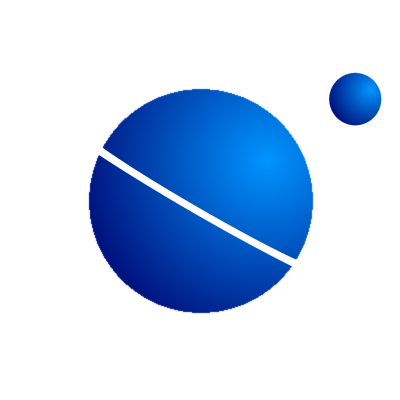

  <picture>
  
  </picture>

# Interstellar

This is an example of how I implement interstellar into 3rd-party applications via external means.\
Garry's Mod was a perfect testing ground due to the amount of customization that it supports.\
This can use "require" or "injection", either way is supported.

Some repo-specific TODO's for me:
- [ ] add runners to build this on debian & windows, x64 & x86